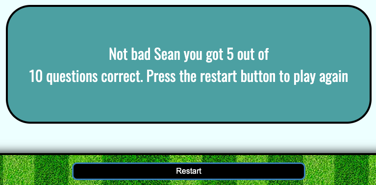

# Football Quiz
A Football(soccer) quiz complete 10 questions, username feedback, live score and question counter and a timer.

Website developed by Sean Johnston for Code Institute Project Portfolio 2 using HTML, CSS and JavaScript.

[Live Website Link](https://seanj06.github.io/Football-Quiz-P2/)

## Table Of Contents

1.[Project Goals](#project-goals)

2.[User Experience(UX)](#user-experience-ux)
  - [User Stories](#1-user-stories)
  - [Design](#2-design)

3.[Features](#features) 
  - [Start Screen](#start-screen) 
  - [Quiz Screen](#quiz-screen)

4.[Testing](#testing)  
  - [Validator Testing](#validator-testing)
  - [Accessibility](#accessibility)
  - [Bugs](#bugs)
  - [Testing User Stories](#testing-user-stories)

5.[Deployment](#deployment)  

6.[Credits](#credits)
  

## Project Goals

- This quiz was created for project 2 of Code Institutes Diploma in full stack web development.

* Main goals of creating this site include

  - Creating a multiple choice quiz using HTML, CSS and JavaScript.

  - Making the quiz fully functional including: Letting the user input a username on game start, a live score and current question tracker, A live timer on game start and A restart button giving the user the option to restart the quiz.

  - Giving the quiz a simple layout and making the site visually appealing for first and returning users.

  - Giving clear instructions and well labelled buttons for users throughout the quiz.

  - Making the site fully responsive for all device sizes.

* Target audience of the site include

  - Users that have an interest in football and want to test their knowledge.

  - Users that want to try out an online quiz for fun.

## User Experience (UX)

  ### 1. User Stories

 - #### First time users

   - As a first time user I want clear instructions on how to start the game.

   - As a first time user I want to be able to play the quiz on multiple devices.

   - As a first time user I want to be given information on my progress in the quiz.

   - As a first time user I want to be able to make a username.

  ### 2. Design

  - #### Colors

    
    - The color of the control buttons and container borders are #000000 (black).
    - The background color of the quiz container is #F0FFFF(azure).
    - The background color of the alert container is #5F9EAO(cadet blue).
    - The hover color of the buttons is #696969(dim gray).
    - The default color of the answer and control button text is #FFFFFF(white).

  - #### Fonts

    - The 2 main fonts used in the site are 'Bungee Spice' and 'Oswald' both taken from google fonts, with a fallback font of sans-serif. 

    - The font used for the Hero Logo is 'Bungee Spice' while the font used for all other body text is 'Oswald'.

[Top of page](#football-quiz)

## Features

### Start screen  
  

  The start screen is complete with a Football Quiz logo with arcade type font, an image of a football, A username input section, a start button and an instruction button.

  - #### Name input
  
    - On game start the users are shown an input box with the label "Enter your username"
    

    - If the user inputs in invalid username an alert message appears telling the user to input a valid username.
    

    - If the user inputs a valid username a welcome message appears.
    

  - #### Instructions button 

    -  When the user clicks the instruction button they are shown a message which tells them they have 100 seconds to answer 10 questions.
    

### Quiz screen
   
  The main quiz screen includes the Football quiz logo, a timer container, the main quiz section container and a stat section container.

 - Timer

   - The timer is shown at the top of the screen just below the logo and counts down from 100 seconds on game start.
   

   - If the timer runs out the user is shown a message telling them they ran out of time and a play again button to restart the game.
   

 - Main Quiz Section 

   The main quiz section features the current question at the top, 4 answer buttons and a next button which moves to the next question once an answer has been selected.
   

    - Question
    
      The question is displayed at the top of the section and has a solid underlined border to seperate it from the answer buttons.
      

    - Answer buttons
     
     
       - The answer buttons are displayed in 2 columns of 2 buttons 

       - The answer buttons change color to either red or green to show the user what the correct answer was.
       The text of the button clicked by the user turns to black and the border is also removed to give the clicked in button effect.
        
      
      - On devices 375 pixels or less the buttons are displayed in 1 column.
           
          

   - Next Button 

     -  The next button displays when a user has selected an answer, It then dissappears when the next question is shown until answer is selected again.
      

 -  Stats Section
   
    The stats section has 3 parts, the header showing the users inputted username, the live current question counter and the live correct answer counter
   

 - End Game Messages

   - When the quiz is complete the user is given a message telling them their score out of 10 and instructing them to press the restart button to play again.

   - There are 3 different end game messages depending on the users final score.

     - If the users final score is less than 4
      

     - If the users final score is between 4 and 6
      

     - If the users final score is over 6
     

[Top of page](#football-quiz)

## Testing

* I have tested this website works on all browser types.

* I have tested the site on various screen sizes and devices using devtools and confirmed it is responsive to all sizes.

* I have tested all of the clickable links work and open in new tabs and have tested that all form elements in the form section work correctly and are required to submit.

### Validator testing

- No errors were shown when putting the code through the w3c html validator.

- No errors were shown when putting the code through the jigsaw css validator.

- No errors were shown when putting the code through jshint javascript validator.
However 2 Warnings are recorded 'A leading decimal point can be confused with a dot: '.5'. I have concluded that these errors are part of the code needed for the shuffle question and answer functions so are unfixable.

### Accessibility

 - The site received high scores on both mobile and desktop when put through lighthouse testing.

   - Lighthouse desktop
   

   - Lighthouse mobile
   

[Top of page](#football-quiz)

### Bugs

  #### Solved Bugs

 | Description | Fix |
 | ----------- | --- |
 | When Testing I discovered when the user clicks the correct answer they were still able to click another button afterwards which caused the score counter to keep incrementing without going onto the next question | I found disabling all of the answer buttons after the first click and the correct answer was shown fixed this bug|
 | When testing I found on game end if the user completed the quiz before the timer ran out and restarted the game, a new timer would start but the old timer would not reset, causing 2 timerS to be running at the same time.| I found that I had coded my timer function incorrectly by creating a variable that could only accessed inside the timer function so in return the stop timer function could not execute correctly, so to fix this bug I created a global timer variable and re structured my start timer and stop timer functions. |
 | When testing I found that on my name input section, the user was allowed into the game by just pressing the space key and not actually typing any characters. | To fix this i added the .trim() built in function onto the end of the user input function which removes any whitespace either side of an input.
 | When testing I found that when pressed one after the other, the start and instruction buttons stack up causing the game to glitch. | To fix this I simply removed both buttons from view until the alert container was hidden again.

  #### Unsolved Bugs

  - There are no known unsolved bugs.

### Testing User Stories

 - As a first time user I want clear instructions on how to start the game.

   - On the main menu of the quiz the user is shown a name input with a prompt to enter a username, there is also an instruction button that when clicked gives them instructions for the quiz and a start button that when clicked without a valid username tells the user to enter a valid username to continue.

- As a first time user I want to be able to play the quiz on multiple devices.

   - The quiz is responsive to all of desktop, tablet and mobile devices and the layout of the quiz changes to fit screens of extra small mobile devices.

- As a first time user I want to be given information on my progress in the quiz.

   - The stats section gives the users information on both the current question they are on, and the amount of correct answers. The timer at the top of the page also tells them how much time they have left.

- As a first time user I want to be able to make a username

   - Users are able to make a username before the game starts and that username will be given to them throughout the quiz including, welcoming them to the quiz, showing their current stats and telling them their final score on game end.

[Top of page](#football-quiz)

## Deployment

### Github pages

 - This website was deployed on github pages using the following steps.
 
   - In the Github repository navigate to the settings tab.
   -  From the settings menu scroll down to pages and click it.
   - In the source section of the pages menu navigate to the branch section and select main.
   - Click save and the page will automatically refresh.

   - Navigate back to the pages section and the live link of the published  site will now be there.
   - [Link to site](https://seanj06.github.io/Football-Quiz-P2/)

 ### Forking the repository  

 - The repository can be forked using the following steps.

   - Log in to github and locate the repository [Football-Quiz-P2](https://github.com/seanj06/Football-Quiz-P2)

   - Click on the repository and at the top right of the page locate the fork button.

   - When you have pressed the fork button you should now have a full copy of the repository.

[Top of page](#football-quiz)

## Credits

- ### Content and code

  -  Code institute gitpod template was used and taken from https://github.com/Code-Institute-Org/gitpod-database-config

  - The 2 fonts used on this site "Bungee Spice" and "Oswald" taken from [Google Fonts](https://fonts.google.com)

  - Part of the quiz was built following a tutorial from Web Dev simplifieds build a javascript quiz youtube video.( The functions on displaying the shuffled questions, and clicked answers.) Each part of javascript code that was taken has been commented appropriately in the javascript file. https://www.youtube.com/watch?v=riDzcEQbX6k

- ### Media 

  - The football hero image and background image were taken from [Pexels.com](https://www.pexels.com/)

- ### Research

  - [Stack Overflow](https://stackoverflow.com/) was used to solve various bugs and issues I had along the way.

  - [W3schools](https://www.w3schools.com/) was used for research on various javascript syntax.

  - [Code Institute LMS](https://www.googleadservices.com/pagead/aclk?sa=L&ai=DChcSEwim9I2zwvv6AhUOtu0KHfviCIwYABAAGgJkZw&ohost=www.google.com&cid=CAESbOD2VcMjWoPOdW1tbLgQgw8S4EBJlhlFi41LS7vVf1YQxjHw5wwKSCMur896-Q3O3rubwxhGsVxLj6MuGnURCfNxcNQR51XOH-mjIEX-ZXTWAl2WWJ-dS0mSruCh43w4CRoPiLbNqZWQG5Q7sg&sig=AOD64_2KLoDtHuB6EOxRKQC5PiyjZjy9kA&q&adurl&ved=2ahUKEwiK94ezwvv6AhUVSUEAHVJxBEwQ0Qx6BAgIEAE) content was used to help me build the quiz along the way

  - [Youtube](https://www.youtube.com/) was used to research how to go about building a javascript quiz.

[Top of page](#football-quiz)

    

